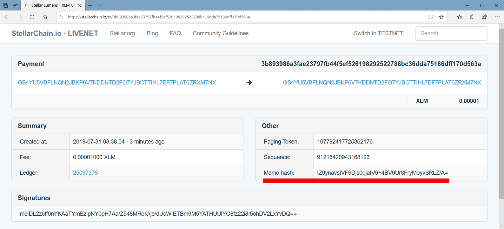

[](https://cran.r-project.org/package=trustedtimestamping)

## Trusted Timestamping
R package for creating Trusted Timestamps.

Trusted Timestamps (tts) are created by incorperating a sha256 hash of a file or dataset into a transaction, stored on a decentralized blockchain. The transaction on the blockchain serves as a secure proof of the exact time at which that data existed.

The package makes use of the Stellar network and of a free service provided by https://stellarapi.io. The Stellar network is chosen because of fast transaction-times (between 5 and 7 seconds) and extremely low costs of transactions.  

## Basic usage

Using this package is simple:

```
x <- 1

# create tts of object/dataset, it takes about 6 seconds to make a transaction

url <- create_ttsObject(x)

# store url of blockchain transaction in your code (or somewhere else)
# this url can later be used for validation
url
[1] "https://horizon.stellar.org/transactions/3b893986a3fae23797fb44f5ef526198292522788bc36dda75186dff170d563a"

# Compare the hash on the Stellar network with the hash generated 'on the fly' 
# p.s. wait 6 seconds after creation of tts (time needed for confirmation)

validate_hashObject(url, x)
[1] "correct"

x <-2
validate_hashObject(url, x)
[1] "not correct"
```
Take note: conformation proces on Stellar network takes 6 seconds. **If you validate a hash when the transaction is not confirmed, 
the result will be 'not correct'.** And remember to store the provided url for later use! 

When a firewall is blocking cUrl requests, you can use a proxyserver:

```
url <- create_ttsObject(x, '10.10.10.10', 8080)
```

It is also possible to create a trusted timestamp of a file (instead of an object or dataset):

```
url <- create_ttsFile("E:/data.rds")

# remember to wait a couple of seconds before validating a hash!
validate_hashFile(url, "E:/data.rds")
[1] "correct"
```

## 'Helper functions'
The package includes some helper functions. These functions are meant for manual checks:

```
get_timestamp(url)
[1] "2019-07-31T08:38:04Z"

get_hash(url)
[1] "219d329dabecb5517d0e3b34aa36ad57dfb8055f54afc16bc8ca32bd244b67f0"
```

In case you want to create a hash 'on the fly', you can use:

```
create_hashFile("E:/data.rds")
[1] "744e41f7d7e1f05bd29229a944ee598b94d593aec4c012e50bdeb63a1cd0b6b7"

create_hashObject(x)
[1] "219d329dabecb5517d0e3b34aa36ad57dfb8055f54afc16bc8ca32bd244b67f0"
```


In case you want to get the transaction on the Stellar network in html form, you can use:

```
get_url_blockchaintransaction(url)
[1] "https://stellarchain.io/tx/3b893986a3fae23797fb44f5ef526198292522788bc36dda75186dff170d563a"
```

The provided url shows all information of the transaction on the Stellar network. This serves as a secure proof of the exact time at which that data existed. Be aware: **Stellar stores hashes in binairy format and presents them base64 encoded.** 

<br/>




Use the following code to convert the base64encoded hash to regular hexadecimal form:

```
convert_stellarHash("IZ0ynavstVF9Djs0qjatV9+4BV9Ur8FryMoyvSRLZ/A=")
[1] "219d329dabecb5517d0e3b34aa36ad57dfb8055f54afc16bc8ca32bd244b67f0"
```

## About stellarapi.io and stellar.org
Stellarapi.io provides a free service and is a non-commercial research project. Use this service at your own risk. Availability is not guaranteed. Stellarapi.io is not maintained by or officially endorsed by the Stellar Foundation. This package uses stellarapi.io for **creating** transactions on the stellar network. In the unchangeable blockchain of the stellar network, the hash is permanently stored. **Validation** is done directly on the stellar network (horizon). Because of this, validation can be done even when stellarapi.io is no longer available.   

The original blockchain transaction can allways be viewed by substituting stellapi/gethash with stellarchain or horizon.stellar.org:

```
https://stellarapi.io/gethash/3b893986a3fae23797fb44f5ef526198292522788bc36dda75186dff170d563a

https://stellarchain.io/tx/3b893986a3fae23797fb44f5ef526198292522788bc36dda75186dff170d563a (html)
https://horizon.stellar.org/transactions/3b893986a3fae23797fb44f5ef526198292522788bc36dda75186dff170d563a (json)
```
As stated above, you can convert the base64encoded hash to regular hexadecimal form with convert_stellarHash("bases64encodedhash").
